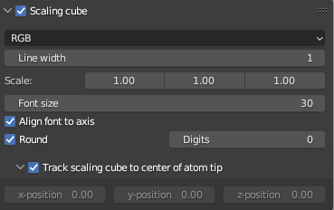
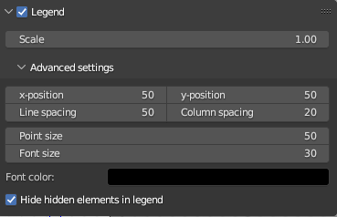
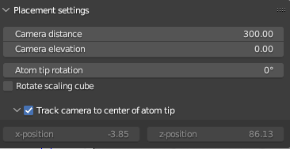
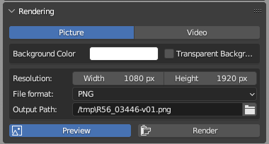
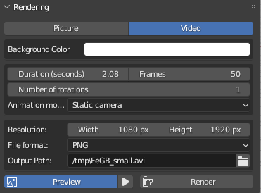

# AtomBlend-II: A visualization addon for Blender (3.5+)
**Display and edit data from atom tips and render images or videos of your science.**

  
  
  

## Installation of the addon
Install the addon as explained on [the Blender website](https://docs.blender.org/manual/en/latest/editors/preferences/addons.html). 
It can be helpful to clone this GitHub repository directly into Blender's addons folder. By doing this you can easily pull updates from git instead of installing the addon on every update. In your Blender working directory AtomBlend-II should be located at [`./scripts/addons/AtomBlend-II/`](https://docs.blender.org/manual/en/latest/advanced/blender_directory_layout.html#path-layout). 
Remember that the addon will not be automatically enabled. Enable it as explained [here](https://docs.blender.org/manual/en/latest/editors/preferences/addons.html#installing-add-ons). 
Restart Blender after installation and enabling. 
Go to 3D View, press `N` if the sidebar isn't showing yet, then click `AtomBlend-II`.

## Usage of the addon
### File loading

Click the file browser icon in the first line to load .pos or .epos files and the icon in the second line to load .rng or .rrng files. 
<b>Depending on your hardware, file loading may take a while! Try not to click anywhere while loading a file as Blender may crash in that case.</b>
  
After loading both the .pos/.epos and .rng/.rrng files, your screen should look similar to this: 

Click `Unload .pos/.epos and .rng/.rrng file` to unload both files.

### Display settings
In this menu the appearance of the atom tip can be changed. You can hide specific elements or edit the color or shown percentage of a certain element.

`Point size` - Changes the point size of all the atoms 
`Total displayed` - Changes the percentage of all the displayed atoms 

<b>The following lines describe the data for every element</b> 
`Hide/Display icon` - Hides or displays the element 
`Name` - The name of the element 
`Color` - The color of this element 
`Point size` - The point size of this element 
`% Displayed` - The displayed percentage of this element 
`# Displayed` - The amount of displayed atoms of this element (can not be changed) 
`Export` - Exports this element as separate object in Blender (<b>As we are using point clouds to keep the frame time in the viewport fast, this feature can only be used in the [Blender alpha version (currently 3.6.0 Alpha)](https://builder.blender.org/download/daily/)</b>). Currently, it is not possible to change the color or point size of the exported object.  

### Scaling Cube
In this menu you can change the appearance of the scaling cube around the atom tip or disable it completely.

`Scaling Cube` - Disable/Enable the scaling cube 
`RGB / Uniform` - Color the axes differently (x-axis red, y-axis green, z-axis blue) or choose a uniform color. 
`Line width` - Change the line width of the scaling cube 
`Scale` - Change the size of the scaling cube regarding the x, y or z axis 
`Font size` - Change the font size of the measurements of the scaling cube 
`Align font to axis` - If activated, the font of the scaling cube will be aligned to the axes 
`Round` - If enabled the measurements of the scaling cube will be rounded by the specified number of `Digits` 
`Track scaling cube to center of atom tip` - If enabled, the scaling cube is tracked to the center of the atom tip 
`x/y/z-position` - If the scaling cube is not tracked to the center of the atom tip, the scaling cube can be moved along a certain axis 

### Legend
In this menu you can change the appearance of the legend. Either scale the complete legend or make more detailed settings in `Advanced settings`. 
Open the `Preview` mode to see how the legend will look on your rendering.

`Legend`- Disable/Enable the legend 
`Scale` - Change the scale of the complete legend 

Open the `Advanced settings` to make detailed settings to the appearance of the legend. 
`x-/y-position` - Change the x- or y-position of the legend 
`Line spacing` - Change the line spacing between the different elements 
`Column spacing` - Change the column spacing between the circles showing the color of the element and the element name 
`Point size` - Change the point size of the circles showing the color of the element 
`Font size` - Change the font size of the element names 
`Font color` - Change the font color of the element names 
`Hide hidden elements in legend` - If activated, the elements you hid in the `Display settings` will also be hidden in the legend 

### Placement settings
Make camera settings 

`Camera distance` - Change the distance of the camera to the tip 
`Camera elevation` - Change the elevation of the camera 
`Atom tip rotation` - Change the rotation of the tip 
`Rotate scaling cube` - If activated, the scaling cube is also rotated 
`Track camera to center of atom tip` - If enabled, the camera is always tracked to the center of the atom tip 
`x/z-position` - If the camera is not tracked to the center of the atom tip, the camera position can be moved.

### Rendering
In this menu you can first chose between rendering a picture or a video, make render settings and finally render your science. 
`Picture / Video` - Select if you want to render a picture or video 

#### Picture
Rendering a picture 

`Background color` - Change the background color of the rendering 
`Transparent Background` - Enable a transparent background. Only available for PNG and TIFF images as JPG images don't support transparency  
`File Format` - Select the file format of your rendering. Currently, you can select between PNG, JPG and TIFF 
`Output Path` - Select the output path of your rendering 
`Preview` - Preview your rendering 
`Render` - Render a picture of your tip. Currently, only PNG files are supported. 

#### Video
Render a video 

`Camera distance` - Change the distance of the camera to the tip 
`Camera rotation` - Change the start of the rotation of the tip 
`Camera elevation` - Change the elevation of the camera 
`Background color` - Change the background color of the rendering. Currently, transparent backgrounds aren't available for video rendering 
`Frames` - Total frame of your video, the approximal duration of the video is also shown 
`Number of rotations` - Change the number of rotations in your video 
`Animation mode` - Change the animation of your video. You can select between:
  - Static camera: Camera stays at the same height 
  - Top to bottom: Camera moves from top to bottom 

`File Format` - The file format of your rendering will be AVI. But first, all the frames will be rendered separately and will be converted to a video later. Here, you can choose the file format for these frames. You can select between PNG, JPG and TIFF 
`Output Path` - Select the output path of your rendering 
`Preview` - Preview your rendering 
`Render` - Render a video of your tip. Currently, only AVI files are supported. <b>Depending on your hardware and frame time, rendering may take a while! Try not to click anywhere while rendering as Blender may crash in that case.</b> 

When rendering a video, it can be helpful to open the terminal to see the progress of your render.
This works different on Windows, macOS and Linux. Refer to [the Blender website](https://docs.blender.org/manual/en/3.0/advanced/command_line/launch/index.html) and follow the instructions for your platform.

